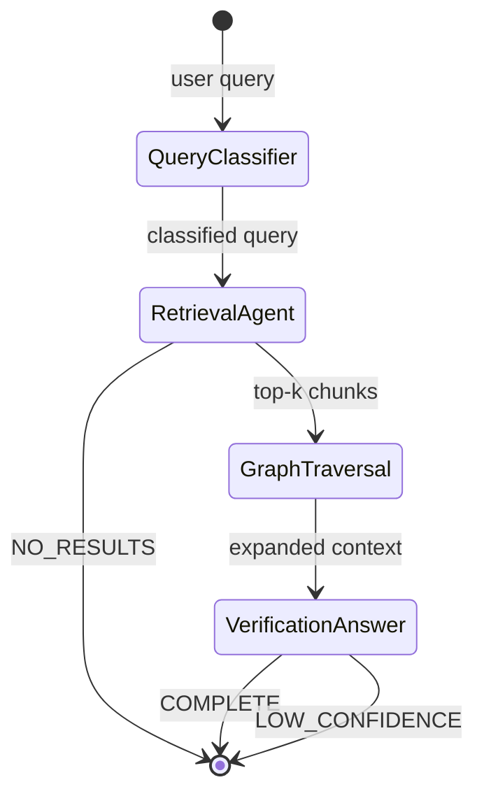

# AGENTS.md

## 1. Overview

CaseMinds uses a 4-agent LangGraph pipeline. Each agent has a strict
Pydantic input/output contract. No agent can be skipped — the state machine
enforces the sequence.



## 2. Shared Pipeline State

```python
class PipelineState(TypedDict):
    query: str
    query_type: QueryType | None       # STATUTE / CASE_LAW / GENERAL
    statute_refs: list[str]            # e.g. ["S.138 NI Act"]
    retrieved_chunks: list[ChunkResult]
    traversal_results: list[TraversalResult]
    overruled_warnings: list[str]      # doc_ids flagged as overruled
    draft_answer: str | None
    verified_citations: list[CitationRef]
    unverified_claims: list[str]
    confidence: float
    status: Literal["IN_PROGRESS","COMPLETE","LOW_CONFIDENCE","NO_RESULTS"]
    trace: list[TraceEntry]
```

## 3. Agent Contracts

### Agent 1 — Query Classifier

**Purpose:** Determine how to route retrieval. A query about a specific section
needs BM25-first routing. A vague principle query needs dense-first.

**Model:** Groq Llama 3.3 (structured output, fast + free).

**Input:** `query: str`

**Output:**
```python
class ClassifiedQuery(BaseModel):
    query_type: Literal["STATUTE", "CASE_LAW", "GENERAL"]
    statute_refs: list[str]      # ["Section 138 NI Act", "Order 39 CPC"]
    case_refs: list[str]         # named cases mentioned in query
    retrieval_strategy: Literal["BM25_FIRST", "DENSE_FIRST", "HYBRID_EQUAL"]
    rewritten_query: str         # cleaned, expanded query for retrieval
```

**Routing logic:**
- STATUTE query + specific section → BM25_FIRST
- CASE_LAW query with case name → DENSE_FIRST with case_name filter
- GENERAL principle → HYBRID_EQUAL

**Prompt** (`services/agents/prompts/query_classifier_v1.txt`):
```
You are a legal query classifier for Indian law.

Classify the following query and extract any statute references or case names.

Query: {query}

Respond in JSON only:
{
  "query_type": "STATUTE|CASE_LAW|GENERAL",
  "statute_refs": [...],
  "case_refs": [...],
  "retrieval_strategy": "BM25_FIRST|DENSE_FIRST|HYBRID_EQUAL",
  "rewritten_query": "..."
}
```

---

### Agent 2 — Retrieval Agent

**Purpose:** Hybrid retrieval (BM25 + dense) → CrossEncoder rerank → top-5.

**Model:** No LLM call. Pure retrieval.

**Input:** `ClassifiedQuery`

**Process:**
1. BM25 search on `rewritten_query` → top-25 (fast, keyword precision).
2. Dense search (ChromaDB) on `rewritten_query` → top-25.
3. Metadata filter: if `statute_refs` present, filter ChromaDB by `acts_cited`.
4. RRF fusion of both lists → top-25 unique chunks.
5. CrossEncoder rerank (`cross-encoder/ms-marco-MiniLM-L-6-v2`) → top-5.
6. If max score < `MIN_RETRIEVAL_SCORE` (0.3) → set `status=NO_RESULTS`.

**Output:**
```python
class ChunkResult(BaseModel):
    chunk_id: str
    doc_id: str
    text: str
    score: float
    metadata: dict   # case_name, citation, court, date, is_overruled
```

**Implementation** (`services/retrieval/search.py`):
```python
def hybrid_search(
    query: str,
    statute_refs: list[str],
    strategy: str,
    top_k: int = 5,
) -> list[ChunkResult]:
    # BM25
    bm25_results = bm25_search(query, n=25)
    # Dense
    filters = build_chroma_filters(statute_refs)
    dense_results = chroma_search(query, filters=filters, n=25)
    # RRF fusion
    fused = reciprocal_rank_fusion(bm25_results, dense_results)
    # Rerank
    pairs = [(query, r.text) for r in fused[:25]]
    scores = reranker.predict(pairs)
    ranked = sorted(zip(fused, scores), key=lambda x: x[1], reverse=True)
    return [ChunkResult(**r[0].__dict__, score=r[1]) for r in ranked[:top_k]]
```

---

### Agent 3 — Graph Traversal

**Purpose:** Expand retrieved judgments via citation graph. Detect overruled
cases on the traversal path. Surface the "current binding position."

**Model:** No LLM call. Pure graph traversal.

**Input:** `list[ChunkResult]`

**Process:**
1. For each `doc_id` in top-5 chunks, call `graph_store.traverse(doc_id,
   directions=["CITES","CITED_BY"], max_hops=2, limit=20)`.
2. Collect unique traversal nodes not already in retrieved set.
3. Flag any node with `is_overruled=True` → add to `overruled_warnings`.
4. Fetch text chunks for top traversal nodes (by centrality in subgraph —
   nodes with most incoming edges = most-cited = most authoritative).
5. Append up to 5 traversal-sourced chunks to context.

**Output:** Expanded `list[ChunkResult]` (max 10 total) + `overruled_warnings`.

**Why this matters:** A query about "cheque bounce" retrieves Rangappa (2010).
The graph traversal finds Bir Singh (2019) which "distinguished" Rangappa for
a specific fact pattern — this is the binding position for that pattern, and
would be missed by retrieval alone.

---

### Agent 4 — Verification + Answer Agent (hard gate)

**Purpose:** Generate a grounded, cited answer. Verify every citation.
Never let an unverified citation reach the user.

**Model:** Groq Llama 3.3 70B (generation) + SQLite lookup (verification).

**Input:** `list[ChunkResult]` (expanded) + `overruled_warnings` + original `query`

**Generation prompt** (`services/agents/prompts/answer_v1.txt`):
```
You are CaseMinds, a legal research assistant for Indian law.

Answer the query using ONLY the provided case excerpts.
For every legal proposition, cite the source using [CITE:doc_id].
If the provided context does not contain sufficient information to answer
confidently, output exactly: INSUFFICIENT_CONTEXT

Do NOT fabricate case names, citations, or legal propositions.
Do NOT use knowledge outside the provided excerpts.

Context:
{context}

Overruled warnings (do NOT present these as current good law):
{overruled_warnings}

Query: {query}
```

**Verification process:**
```python
def verify_citations(answer: str, overruled_warnings: list[str]) -> VerifiedAnswer:
    tags = re.findall(r'\[CITE:([^\]]+)\]', answer)
    verified, unverified = [], []

    for doc_id in tags:
        row = db.get_judgment(doc_id)
        if row is None:
            unverified.append(doc_id)
            answer = answer.replace(f"[CITE:{doc_id}]", "[CITATION REMOVED]")
        elif doc_id in overruled_warnings:
            answer = answer.replace(
                f"[CITE:{doc_id}]",
                f"[⚠️ OVERRULED: {row.case_name} — verify current position]"
            )
            verified.append(doc_id)
        else:
            answer = answer.replace(
                f"[CITE:{doc_id}]",
                f"[{row.case_name}, {row.citation}]"
            )
            verified.append(doc_id)

    confidence = len(verified) / max(len(tags), 1)
    status = "COMPLETE" if confidence >= 0.85 else "LOW_CONFIDENCE"

    return VerifiedAnswer(
        answer=answer,
        verified_citations=verified,
        unverified_claims=unverified,
        confidence=confidence,
        status=status,
        disclaimer="CaseMinds is a research aid. Verify citations independently. Not legal advice.",
    )
```

**INSUFFICIENT_CONTEXT handling:** If the model outputs `INSUFFICIENT_CONTEXT`
(or retrieval score was below threshold), return:
```json
{
  "status": "LOW_CONFIDENCE",
  "answer": "CaseMinds could not find sufficient authority in its corpus to answer this query confidently. Please search Indian Kanoon directly or consult a senior colleague.",
  "confidence": 0.0
}
```

## 4. LLM Routing

| Agent | Model | Rationale |
|---|---|---|
| Query Classifier | Groq Llama 3.3 8B | Tiny task, structured output, fast |
| Retrieval | None | Pure algorithmic |
| Graph Traversal | None | Pure algorithmic |
| Verification + Answer | Groq Llama 3.3 70B | Quality matters for final output |

Fallback: if Groq is down, fall back to `claude-haiku-4-5` (Anthropic API).
Configured in `services/agents/llm_client.py`.

## 5. Tool Definitions (`services/agents/tools/`)

```python
# Available to agents via LangGraph tool node
tools = [
    fetch_judgment_metadata,   # SQLite lookup by doc_id
    search_graph,              # graph_store.traverse()
    hybrid_search,             # retrieval pipeline
    check_overruled,           # is this doc_id overruled?
    get_kanoon_link,           # returns Indian Kanoon URL for doc_id
]
```
