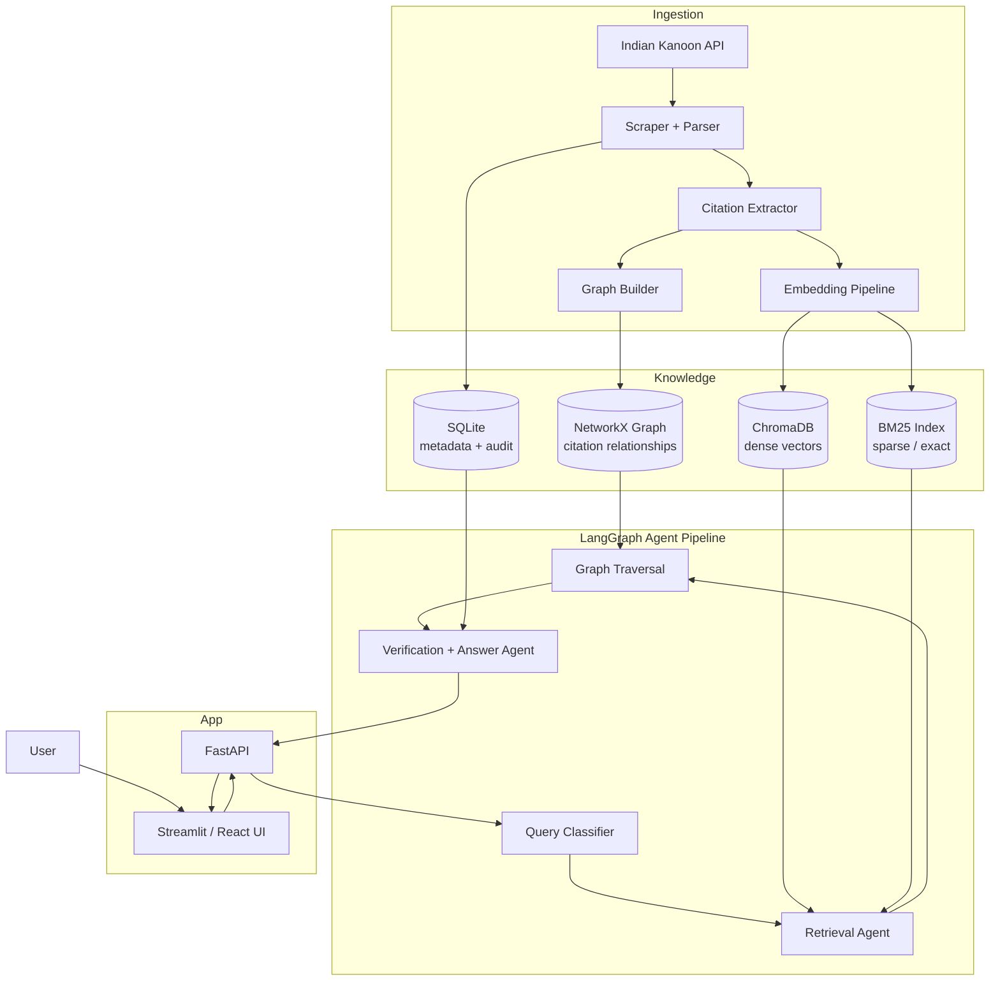
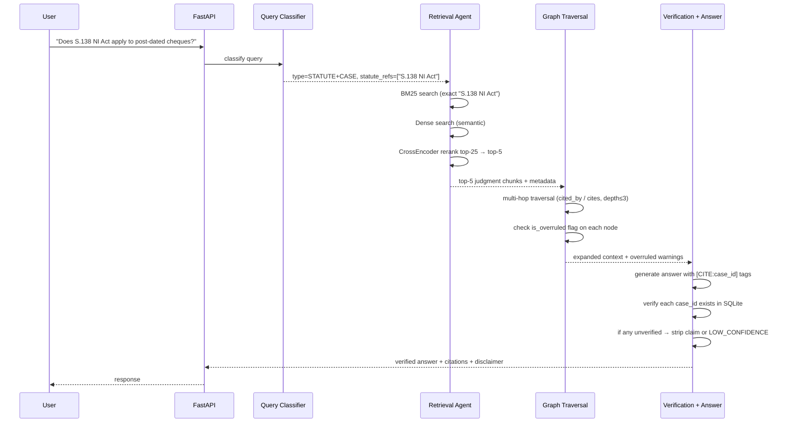
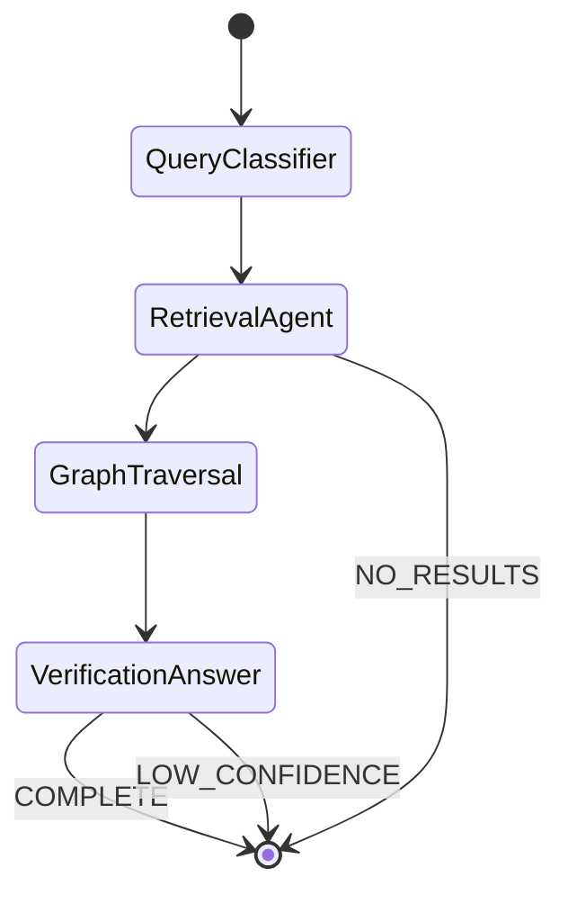

# ARCHITECTURE.md

## 1. System Overview



## 2. End-to-End Query Flow



## 3. Component Detail

### 3.1 Ingestion

Indian Kanoon exposes a REST API (free, requires registration):
- `GET /search/?formInput=<query>&pagenum=<n>` — search results
- `GET /doc/<doc_id>/` — full judgment text + metadata

The ingestion pipeline:
1. Searches by topic/act (e.g., "Section 138 Negotiable Instruments Act").
2. Fetches full judgment text.
3. Extracts structured metadata: `case_name`, `citation`, `court`, `date`,
   `judges`, `acts_cited[]`, `judgments_cited[]`.
4. Stores raw JSON in `data/processed/`.
5. Builds citation graph edges.
6. Chunks text → embeds → upserts to ChromaDB.
7. Builds BM25 index over full text.

### 3.2 Knowledge Graph (NetworkX)

```
Nodes:
  Judgment  {doc_id, case_name, citation, court, date, is_overruled}
  Statute   {act_name, section, text_excerpt}

Edges:
  (Judgment)-[CITES]->(Judgment)         # extracted from judgment text
  (Judgment)-[CITES_STATUTE]->(Statute)  # extracted section references
  (Judgment)-[OVERRULED_BY]->(Judgment)  # detected via "overruled in" phrases
  (Judgment)-[DISTINGUISHED_BY]->(Judgment)
```

Multi-hop traversal via BFS (depth ≤ 3, limit 30 nodes):
- Forward: "what cases cite this judgment?" (precedent application)
- Backward: "what does this judgment cite?" (authority chain)
- Overruled check: if any node on path has `is_overruled=True`, surface warning.

### 3.3 Hybrid Retrieval

Two parallel retrieval channels, fused before reranking:

| Channel | Implementation | Best For |
|---|---|---|
| Dense | ChromaDB + BAAI/bge-small-en-v1.5 | Semantic queries ("cheque bounce limitation period") |
| Sparse | rank-bm25 (BM25Okapi) | Exact statute refs ("Section 138 NI Act", case citations) |

Fusion: reciprocal rank fusion (RRF) of both result lists → top 25 → CrossEncoder rerank → top 5.

### 3.4 LangGraph Agent State Machine



### 3.5 Verification Gate

For each `[CITE:doc_id]` tag in the generated answer:
1. Look up `doc_id` in SQLite metadata table.
2. If not found → `UNVERIFIED` → strip the claim.
3. If found but `is_overruled=True` → keep but prepend `⚠️ OVERRULED:`.
4. If verified → replace tag with formatted citation + excerpt link.

If verified_claims / total_claims < 0.85 → return `LOW_CONFIDENCE` status.

## 4. Key Architectural Decisions

| Decision | Rationale |
|---|---|
| NetworkX over Neo4j | Zero cost, no infra, citation graph fits in memory for 10K–50K nodes; swap is 1 file if scale demands |
| ChromaDB over Qdrant | Free, local, persistent, no account needed |
| BAAI/bge-small over voyage-law-2 | Free, 33MB, good enough for Indian legal text; swap to voyage-law-2 for production |
| Groq Llama 3.3 over Claude | Free tier, <150ms first token — latency matters for chat UX; Claude Haiku as fallback |
| BM25 mandatory alongside dense | "Section 138 NI Act" semantic drift is real — pure dense retrieval returns thematically similar but section-wrong results |
| Streamlit for V1 UI | Ships in hours, looks professional, no frontend build pipeline needed for MVP |
