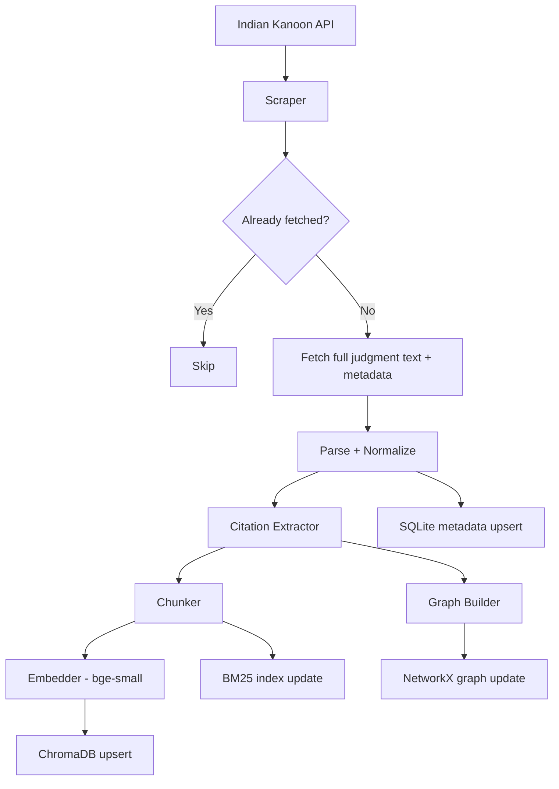

# DATA_PIPELINE.md

## 1. Data Sources

| Source | Access | Content | Cost |
|---|---|---|---|
| Indian Kanoon API | Free (register at indiankanoon.org) | SC + HC judgments, full text | $0 |
| Indian Kanoon Web | Fallback scrape (polite) | Same | $0 |
| Legislative.gov.in | Public HTML | Bare Acts (IPC, CPC, NI Act, etc.) | $0 |

**V1 corpus scope:** Supreme Court judgments tagged with NI Act (Section 138),
IPC (Sections 302, 420, 376), and CPC (Order 7, Order 39). ~500–800 judgments.

## 2. Pipeline Flow



## 3. Scraper (`services/ingestion/scraper.py`)

```python
class IndianKanoonScraper:
    BASE = "https://api.indiankanoon.org"

    def search(self, query: str, max_pages: int = 5) -> list[str]:
        """Returns list of doc_ids matching query."""
        doc_ids = []
        for page in range(max_pages):
            r = httpx.get(
                f"{self.BASE}/search/",
                params={"formInput": query, "pagenum": page},
                headers={"Authorization": f"Token {self.api_key}"},
                timeout=30,
            )
            data = r.json()
            doc_ids += [d["tid"] for d in data.get("docs", [])]
            if not data.get("docs"):
                break
            time.sleep(1.0)   # polite crawling
        return doc_ids

    def fetch(self, doc_id: str) -> RawJudgment:
        """Fetches full judgment. Caches to data/raw/{doc_id}.json."""
        cache = Path(f"data/raw/{doc_id}.json")
        if cache.exists():
            return RawJudgment(**json.loads(cache.read_text()))
        r = httpx.get(f"{self.BASE}/doc/{doc_id}/", ...)
        data = r.json()
        cache.write_text(json.dumps(data))
        return RawJudgment(
            doc_id=doc_id,
            title=data["title"],
            text=data["doc"],
            date=data.get("publishdate"),
            court=data.get("docsource"),
            citation=data.get("citation"),
        )
```

## 4. Parser + Normalizer (`services/ingestion/parser.py`)

Extracts structured fields from raw judgment text:

```python
@dataclass
class ParsedJudgment:
    doc_id: str
    case_name: str
    citation: str | None      # e.g. "(2010) 11 SCC 441"
    court: str                # "Supreme Court of India"
    date: date | None
    judges: list[str]
    acts_cited: list[ActRef]  # e.g. [ActRef("NI Act", "138")]
    cases_cited: list[str]    # doc_ids of cited judgments (resolved)
    is_overruled: bool        # detected via phrase patterns
    overruled_by: str | None  # doc_id of overruling judgment
    full_text: str
    chunks: list[str]         # split for embedding
```

**Citation resolution:** Regex patterns for Indian citation formats:
- `(\(\d{4}\)\s+\d+\s+SCC\s+\d+)` — SCC reporter
- `AIR\s+\d{4}\s+SC\s+\d+` — AIR reporter
- `\d{4}\s+\(\d+\)\s+SCC\s+\d+` — alternate SCC format

Resolved citations are matched against the existing `doc_id` index by
case_name fuzzy match (rapidfuzz, threshold 85) when exact citation not found.

**Overruled detection:** Regex on full text:
```python
OVERRULED_PATTERNS = [
    r"overruled\s+in\s+(.+?)\s*[\(\[]",
    r"expressly\s+overruled\s+by",
    r"no\s+longer\s+good\s+law",
    r"not\s+follow\s+.{0,50}(earlier|previous)\s+decision",
]
```

## 5. Citation Extractor (`services/ingestion/citation_extractor.py`)

Two-pass extraction:

**Pass 1 — Regex:** Fast, catches 70–80% of citations in standard formats.

**Pass 2 — LLM assist (Groq Haiku, batched):** For paragraphs containing
"relying on", "as held in", "following", "distinguished", "overruled" but
no matching regex pattern. Batched to minimize API calls — one LLM call per
5 paragraphs. Output: `list[CitationExtraction]` with `case_name`, `year`,
`relationship` (CITES / DISTINGUISHES / OVERRULES).

## 6. Graph Builder (`services/graph/graph_store.py`)

```python
class GraphStore:
    def __init__(self, path: str = "data/graph.pkl"):
        self.G = nx.DiGraph()
        self._load()

    def add_judgment(self, j: ParsedJudgment):
        self.G.add_node(j.doc_id,
            type="judgment",
            case_name=j.case_name,
            citation=j.citation,
            court=j.court,
            date=str(j.date),
            is_overruled=j.is_overruled,
            overruled_by=j.overruled_by,
        )
        for cited_id in j.cases_cited:
            self.G.add_edge(j.doc_id, cited_id, rel="CITES")
        if j.is_overruled and j.overruled_by:
            self.G.add_edge(j.doc_id, j.overruled_by, rel="OVERRULED_BY")

    def traverse(
        self,
        start_id: str,
        directions: list[str] = ["CITES", "CITED_BY"],
        max_hops: int = 3,
        limit: int = 30,
    ) -> list[TraversalResult]:
        """BFS. Returns nodes with hop count + path + overruled flag."""
        visited, results, queue = set(), [], [(start_id, 0, [])]
        while queue and len(results) < limit:
            node, hops, path = queue.pop(0)
            if node in visited or hops > max_hops:
                continue
            visited.add(node)
            data = self.G.nodes.get(node, {})
            if hops > 0:
                results.append(TraversalResult(
                    doc_id=node,
                    hops=hops,
                    path=path,
                    is_overruled=data.get("is_overruled", False),
                    case_name=data.get("case_name", ""),
                ))
            for neighbor in self._neighbors(node, directions):
                queue.append((neighbor, hops + 1, path + [node]))
        return results

    def _neighbors(self, node, directions):
        neighbors = []
        if "CITES" in directions:
            neighbors += list(self.G.successors(node))
        if "CITED_BY" in directions:
            neighbors += list(self.G.predecessors(node))
        return neighbors
```

## 7. Embedding Pipeline (`services/ingestion/embedder.py`)

- Model: `BAAI/bge-small-en-v1.5` (33MB, CPU-friendly)
- Chunking: 400-token chunks, 50-token overlap (legal paragraphs are dense)
- ChromaDB upsert with metadata: `doc_id`, `case_name`, `court`, `date`,
  `citation`, `acts_cited[]`, `is_overruled`
- BM25 index rebuilt incrementally (pickled `BM25Okapi` object)

## 8. Seed Script (`scripts/seed.py`)

```bash
make seed
# Runs:
# 1. scraper: fetches ~500 judgments across 5 act-topics
# 2. parser: normalizes all
# 3. citation_extractor: builds citation list
# 4. graph_store: builds NetworkX graph, saves data/graph.pkl
# 5. embedder: embeds all chunks → ChromaDB
# 6. bm25: builds BM25 index → data/bm25.pkl
# 7. sqlite: upserts all metadata
# Time: ~8-12 min first run, cached thereafter
```

## 9. Incremental Updates

Daily cron (or manual `make update`):
1. Search Indian Kanoon for judgments published in last 7 days (by act topic).
2. Only fetch/process new `doc_id`s (SQLite `ingested_at` check).
3. Re-check overruled status for judgments older than 30 days (new overruling
   judgments may have appeared).
4. Update graph, ChromaDB, BM25 incrementally.
